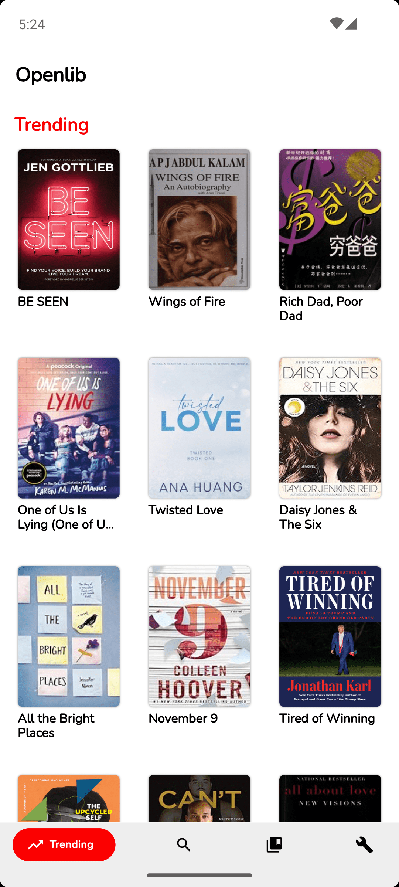
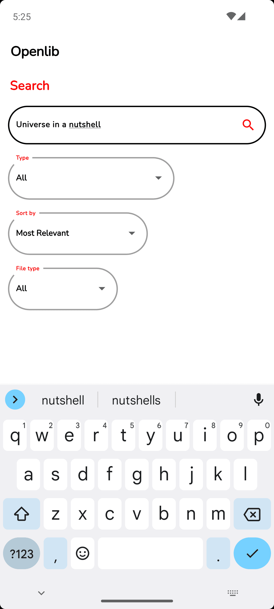
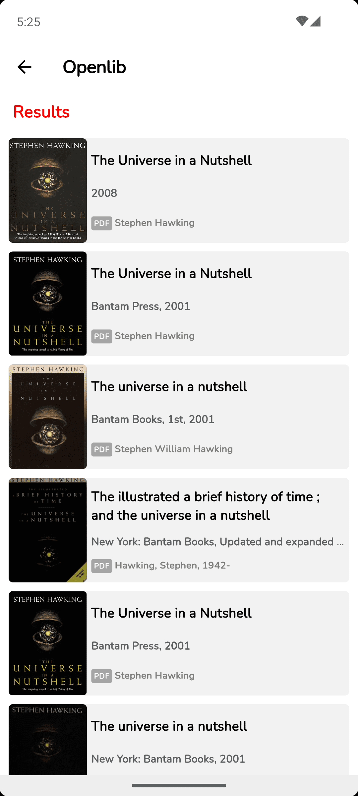
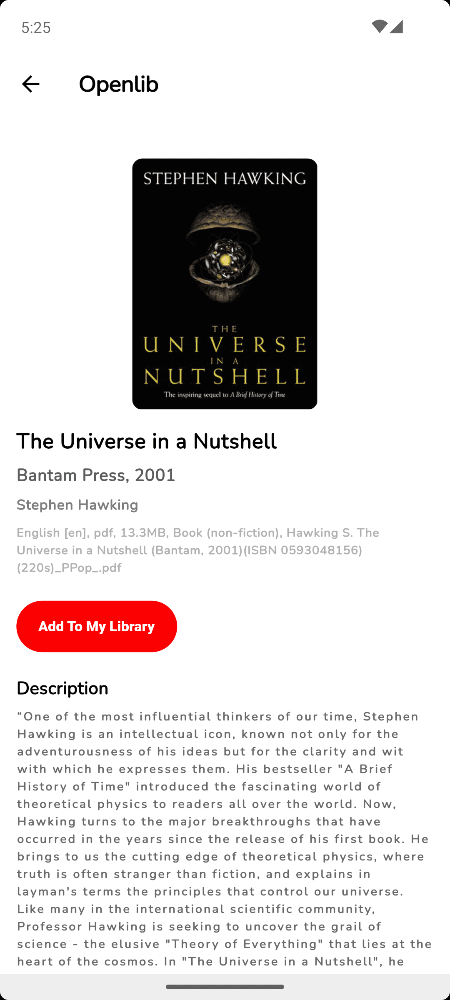
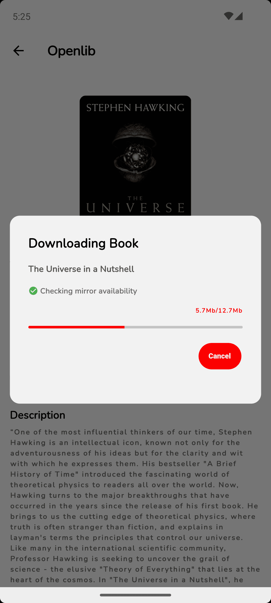

<div align="center">


# OpenLib Extended 中文版

**基于 Anna's Archive 的开源跨平台图书客户端**<br/>
**下载、管理、阅读你喜爱的书籍**

> 基于 [Openlib](https://github.com/dstark5/Openlib) 的 Fork，新增更多功能与桌面端支持！

[](https://flutter.dev/)
[](https://opensource.org/licenses/)
[](https://github.com/hydphalen/OpenlibExtended-1.5.2/releases)

[](https://github.com/hydphalen/OpenlibExtended-1.5.2/releases)

</div>

## ✨ 功能特性

- **跨平台支持** — Android、iOS、Windows、Linux、macOS 全平台覆盖
- **智能下载** — 多镜像自动切换，确保下载稳定可靠
- **高级搜索** — 按语言、格式、年份筛选，支持实时搜索建议
- **内置阅读器** — 支持 EPUB 和 PDF，自定义手势操作
- **书库管理** — 追踪藏书、发现热门书籍、导出文件

## 📸 截图预览

[](screenshots/Screenshot_1.png)
[](screenshots/Screenshot_2.png)
[](screenshots/Screenshot_3.png)
[](screenshots/Screenshot_4.png)
[](screenshots/Screenshot_5.png)

## 📦 下载安装

从 [GitHub Releases](https://github.com/hydphalen/OpenlibExtended-1.5.2/releases) 下载最新版本。

## 🛠️ 开发构建

```bash
git clone https://github.com/hydphalen/OpenlibExtended-1.5.2.git
flutter pub get
flutter run
```

## 📝 更新日志

### v1.6.8-zh-cn
- 中文化界面
- 修复分类页面编译错误
- 优化用户体验

## 📄 许可证

基于 [AGPL v3.0](https://www.gnu.org/licenses/agpl-3.0.html) 开源。

## ⚠️ 免责声明

本应用仅为技术学习用途，所有书籍版权归原作者所有。请遵守当地法律法规，仅用于个人学习。
